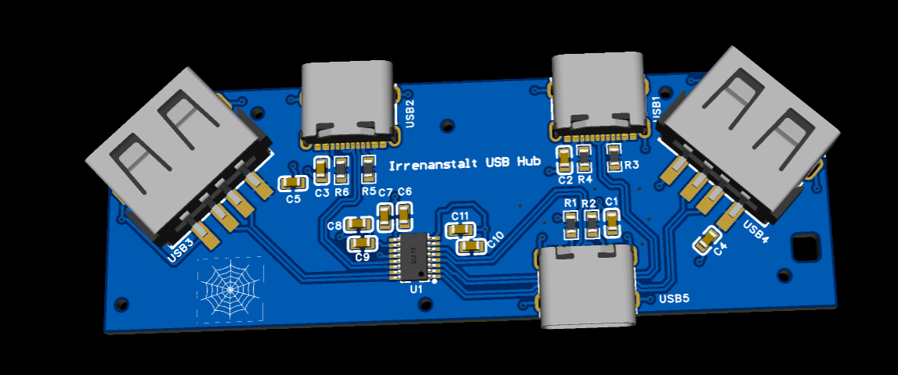

# USB-Hub-Macondo

USB-Hub-Macondo is a USB hub with one USB-C uplink and two USB-C and two USB-A downlinks. It was created together with the [Macondo (Hack Club) guide](https://macondo.hackclub.com/docs/usb-hub).

---

### Highlights:

* USB-C uplink
* 2 × USB-C & 2 × USB-A downlinks
* SL2.1S from CoreChips
* [Link](https://macondo.hackclub.com/projects/15026) to Macondo project
* USB 2.0

---

### Overview:

A USB hub is a device to make multiple USB ports out of one. This hub just uses one of your USB-C ports, but you're getting four ports (3 additional ones) out of the hub.  
The hub uses USB 2.0.

---

### Price:

With fast shipping to Germany from JLCPCB, 5 boards (soldered) cost about $45.

---

### Resources:

You can find all the relevant files in the [`resources/`](./resources) folder, including:

* 📄 [Schematic (PDF)](resources/schematic.pdf)
* 🖨️ [PCB Layout (PDF)](resources/PCB.pdf)
* 📦 [Gerber Fabrication Files (ZIP)](resources/Gerber_files.zip)
* 🧊 [3D Model (STEP)](resources/3D_modell.step)
* 📊 [Bill of Materials (BOM)](resources/BOM.csv)
* 🤖 [Pick and Place CSV](resources/PickAndPlace.csv)
* 💻 [EasyEDA Pro Project Source](resources/project.epro2)
* 🖥️ [PCB Schematic](resources/dxf_pcb_schematic.zip)

---

### License:

This project is open-source hardware licensed under the [MIT License](LICENSE).
